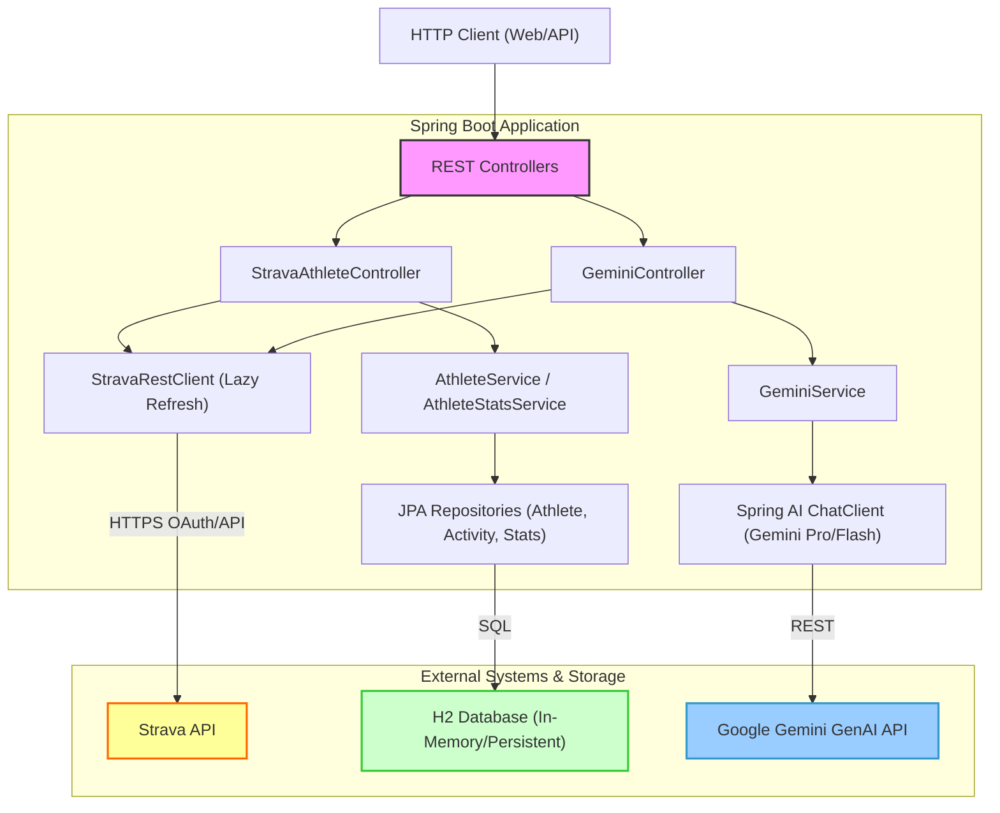
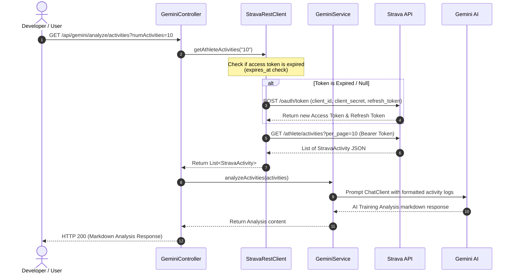

# Strava Stats & AI Training Analyst

This system pulls training data from the Strava API, persists it locally using a relational JPA database (H2), and integrates Google Gemini AI to analyze the athlete's athletic training.

---

## 🏗️ System Architecture

The following diagram illustrates how the system modules interact, route requests, persist records, and perform AI-driven training analysis:



---

## 🔄 Sequence: Activity Analysis

This sequence diagram depicts how a developer or user calls the AI analysis endpoint, triggers lazy authentication check, retrieves training records from Strava, and processes them with Google Gemini:



---

## ⚙️ Configuration & Environment Setup

To run the application, configure your credentials in your environment. The application will bind these properties automatically:

```bash
# Google GenAI API Key (AI Studio)
export GEMINI_API_KEY="AIzaSy..."

# Strava API Application Details
export STRAVA_CLIENT_ID="48445"
export STRAVA_CLIENT_SECRET="d906ca..."

# Athlete Account & Initial Refresh Token
export STRAVA_ATHLETE_ID="13986969"
export STRAVA_REFRESH_TOKEN="081f27..."
```

*Note: In production and dev profiles, settings are injected via environmental placeholders in the [application.properties](file:///Users/chriswelch/workspace/strava-stats/strava/src/main/resources/application.properties) file.*

---

## 🔌 API Endpoint Reference

### 1. Strava Athlete & Local DB Endpoints

| Method | Endpoint | Description |
|:---|:---|:---|
| **GET** | `/athlete` | Fetches active athlete profile from Strava, stores it in database, and returns payload. |
| **GET** | `/athlete/{id}` | Retrieves a previously stored athlete profile from local database. |
| **GET** | `/athlete/stats` | Fetches active athlete stats from Strava, links them to athlete in DB, and returns payload. |
| **GET** | `/athlete/activities` | Fetches activities list. Parameter: `numActivities` (e.g. `?numActivities=5`). |
| **GET** | `/athlete/activity/{id}` | Fetches detailed information for a specific activity ID. |

### 2. Gemini AI Analysis Endpoints

| Method | Endpoint | Description |
|:---|:---|:---|
| **GET** | `/api/gemini/joke` | Generates a topic-based joke using Gemini (default topic: `bicycles`). |
| **GET** | `/api/gemini/analyze/activities`| Fetches latest activities from Strava and runs a comprehensive training workload/fatigue analysis using Gemini. |
| **GET** | `/api/gemini/analyze/stats` | Gathers career/YTD statistics from Strava and requests Gemini to write an athlete career analysis. |

---

## 🛠️ Local Development & Build Commands

Build the project and run the tests locally using the Gradle wrapper:

* **Compile and build JAR**:
  ```bash
  ./gradlew build
  ```
* **Run Unit & Integration Tests**:
  ```bash
  ./gradlew test
  ```
* **Run application locally**:
  ```bash
  ./gradlew bootRun
  ```
